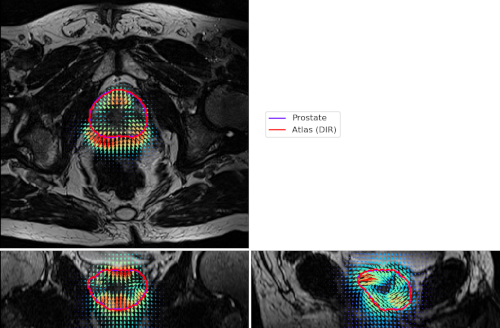

# PlatiPy (Processing Library and Analysis Toolkit for Medical Imaging in Python)

This library contains tools and scripts used for image processing and analysis of medical images.
The code makes use of ITK and VTK and is written in Python. Jupyter notebooks are provided where
possible, mainly for guidance on getting started with using the tools.

## Getting Started

You can find the [PlatiPy documentation here](https://pyplati.github.io/platipy/).

### Requirements

- Python 3.6 or greater
- See requirements.txt for required Python packages and requirements-dev.txt for librarites needed to contribute.

## What can I do with ***platipy***?
A lot! A good place to start is by looking in the **examples** directory. There are tools for:
 - Linear transformation image registration (rigid, affine, etc.)
 - Non-linear deformable image registration
 - Atlas-based segmentation
 - Synthetic deformation field generation
 - DICOM tools (reading/writing, bulk conversion)
 - Image label operations (comparison metrics, iterative atlas removal, label fusion)
 
A major part of this package is **visualisation**, and some examples are shown below!

Overlay a deformation vector field on an image (shown in orthogonal slices):


Overlay a scalar field on an image:


Create a comparison image, with vector fields:


## Contributing

### Git

Create a branch off of **master** while you make your changes or implement your new tool.
Once complete, head to  [GitHub to create a pull 
request](https://github.com/pyplati/platipy/compare) to merge your changes into the main branch
(**master**).

### Style Guide

Python code written in this repository should conform to
[PEP 8 Style Guide for Python](https://www.python.org/dev/peps/pep-0008/). You may like to use
[*black*](https://github.com/ambv/black) to ensure that your code conforms to PEP 8 standards.

### Structure

This toolbox is broken up into separate modules. Each module contains several tools, scripts or
applications. The following structure should be observed:

- module/
    - tool/
        - ***.py**: One or more Python scripts providing some functionality
        - **README.md**: Contains description of tool, authors, etc...
        - **Sample.ipynb**: Jupyter notebook demonstrating the basics of using the tool
    - tests/: Directory containing test scripts to be run by pytest

### Providing command line functionality with *click*

Where possible, the tools and scripts within this toolbox should provide a way to run them from the
command line. A simple Python library to provide this functionality is *click*. You simply need to
annotate the functions you want to have accessible from the command line. See
[the official click documentation](https://click.palletsprojects.com) for an introduction to
using *click*.

### Writing unit tests for *pytest*

Automated unit tests are important for code bases to which various authors are contributing, to
ensure that their changes don't make any unintended breaking changes to other parts of the code.

This toolbox uses *pytest* as the testing framework. See
[the official pytest documentation](https://docs.pytest.org/en/latest/getting-started.html) for an
introduction to writing tests with pytest.

Before you submit a pull request, make sure all the tests are passing by running the command:

```
pytest
```

from the root directory of the toolbox.

## Authors

* **Phillip Chlap** - [phillip.chlap@unsw.edu.au](phillip.chlap@unsw.edu.au)
* **Robert Finnegan** - [rfin5459@uni.sydney.edu.au](rfin5459@uni.sydney.edu.au)
